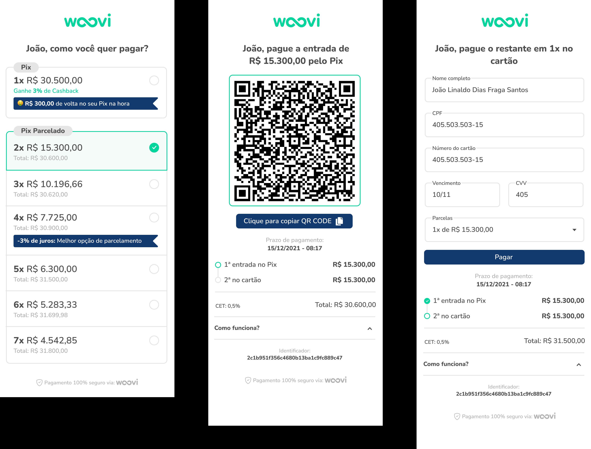

# Desafio Woovi

Esse projeto foi realizado com o intuito de completar o desafio de "Frontend Júnior da Woovi".

## Descrição

O projeto consiste em realizar uma forma de pagamento para o cliente, tendo opções como Pix e Pix Parcelado. Segue design disponibilizado abaixo:



## Tecnologias Utilizadas

-   React
-   TypeScript
-   Material UI
-   Componentização
-   **[Vite](https://vitejs.dev/guide/)**
-   React-Hook-Form
-   Hooks

## Instalação

Para rodar o projeto localmente, siga os passos abaixo:

1. Clone o repositório:

```
git clone https://github.com/lucasmassarico/pix-challenge.git
```

2. Navegue até o diretório

```
cd pix-challenge
```

3. Instale as dependências

```
npm i
```

4. Inicie o ambiente de desenvolvimento:

```
npm run dev
```

## Como usar

Após iniciar o servidor, abra o navegador e acesse \_http://localhost:5173 para visualizar o projeto

## Aprendizados

Ao longo do projeto, tive algumas dificuldades que me proporcionaram vários aprendizados:

-   Aprendi mais sobre a utilização da Material UI. Ao inciar o projeto, utilizei apenas CSS modular, mas depois, busquei entender melhor a biblioteca sugerida pela equipe da Woovi. Devido ao tempo limitado, não consegui criar os temas desejados, então tive que adaptar a biblioteca para atender às necessidades do projeto.

-   Em relação ao TS, melhorar a organização de tipagens.

## Contato

Lucas Massarico

-   lucasmassarico1@gmail.com
-   [Linkedin](https://www.linkedin.com/in/lucasmassarico/)
-   [Github](https://github.com/lucasmassarico)
